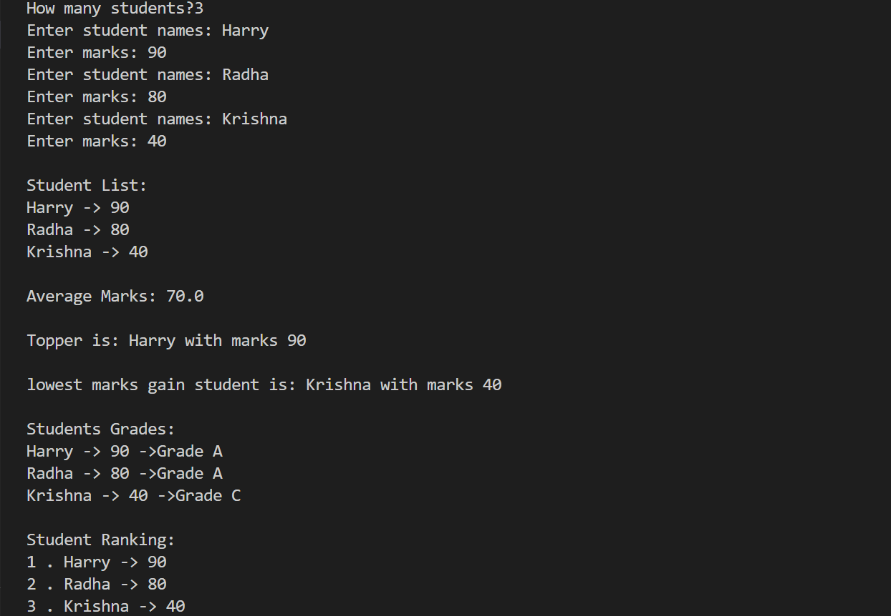

# Student Performance Analyzer

This is a Python project that analyzes student performance.

## Features
- Add student names and marks
- Display student list
- Calculate average marks
- Find topper
- Find lowest marks student
- Assign grades
- Rank students by marks

## How to Run

1. Clone the repository
2. Run the Python file

python student_performance.py

## Project Screenshot

## Project Structure

StudentPerformanceAnalyzer/
│
├── student_performance.py   # Main Python program
├── README.md                # Project description and instructions
└── screenshot.png           # Screenshot of program output

